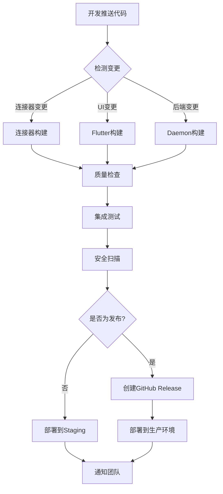

# 🚀 Linch Mind CI/CD System

这个目录包含了Linch Mind项目的完整CI/CD配置，提供了从开发到生产的全自动化流水线。

## 🏗️ 架构概览



## 📁 文件结构

```
.github/
├── workflows/                    # GitHub Actions工作流
│   ├── connector-build.yml      # 🔌 连接器构建和发布
│   ├── daemon-build.yml         # 🔧 Python后端构建和部署
│   ├── flutter-build.yml        # 📱 Flutter多平台构建
│   ├── integration-tests.yml    # 🧪 集成和E2E测试
│   ├── release.yml              # 🚀 完整发布流程
│   └── build-component.yml      # 🔨 可重用组件构建
├── GITHUB_ACTIONS_SETUP.md      # 📋 详细配置指南
└── README.md                    # 📖 这个文件
```

## 🔄 工作流详情

### 🔌 连接器构建 (`connector-build.yml`)

**触发条件**: `connectors/` 目录变更
**功能**:
- 智能变更检测，只构建修改的连接器
- 多平台构建 (Windows, macOS, Linux)
- 代码质量检查和安全扫描
- 自动发布到连接器注册表
- 生成市场文档

### 📱 Flutter构建 (`flutter-build.yml`)

**触发条件**: `ui/` 目录变更或版本标签
**功能**:
- 多平台构建 (Android, iOS, Linux, macOS, Windows, Web)
- 自动化测试和代码质量检查
- 应用签名 (生产环境)
- 创建安装包和发布资产

### 🔧 Daemon构建 (`daemon-build.yml`)

**触发条件**: `daemon/` 目录变更
**功能**:
- Python应用构建和测试
- Docker镜像构建和推送
- API文档生成
- 自动部署到staging/production

### 🧪 集成测试 (`integration-tests.yml`)

**触发条件**: 主分支推送或定时执行
**功能**:
- 完整的测试环境搭建
- API集成测试
- Flutter E2E测试
- 性能基准测试
- API兼容性验证

### 🚀 发布流程 (`release.yml`)

**触发条件**: 版本标签 (`v*`) 或手动触发
**功能**:
- 版本管理和变更日志生成
- 并行构建所有组件
- 完整的测试套件执行
- 安全扫描和漏洞检测
- GitHub Release创建
- 生产环境部署
- 社区通知

## ⚡ 快速开始

### 1. 基础设置

```bash
# 克隆仓库
git clone https://github.com/linch-mind/linch-mind.git
cd linch-mind

# 查看CI/CD配置
ls -la .github/workflows/
```

### 2. 配置Secrets

按照 [`GITHUB_ACTIONS_SETUP.md`](GITHUB_ACTIONS_SETUP.md) 中的指南配置必要的secrets和环境变量。

### 3. 触发构建

```bash
# 开发构建 - 推送到主分支
git push origin main

# 发布构建 - 创建版本标签
git tag v1.0.0
git push origin v1.0.0

# 手动触发 - 使用GitHub网页或CLI
gh workflow run "Flutter Build" -f platforms=linux,windows,macos
```

## 📊 监控和状态

### 构建状态徽章

[](https://github.com/linch-mind/linch-mind/actions/workflows/connector-build.yml)
[](https://github.com/linch-mind/linch-mind/actions/workflows/flutter-build.yml)
[](https://github.com/linch-mind/linch-mind/actions/workflows/daemon-build.yml)
[](https://github.com/linch-mind/linch-mind/actions/workflows/integration-tests.yml)

### 关键指标

- **平均构建时间**: ~15分钟 (完整流程)
- **测试覆盖率**: >80% (目标)
- **部署频率**: 按需发布
- **成功率**: >95% (目标)

## 🛠️ 开发者工具

### 本地验证脚本

```bash
# 验证连接器
python scripts/connector-dev.py validate filesystem

# 构建连接器
python scripts/build-connectors.py build-all

# 运行质量检查
cd daemon && poetry run flake8 .
cd ui && flutter analyze .
```

### 调试CI/CD

```bash
# 启用debug模式
export ACTIONS_STEP_DEBUG=true
export ACTIONS_RUNNER_DEBUG=true

# 查看工作流状态
gh run list --workflow="Flutter Build"

# 下载构建产物
gh run download [RUN_ID]
```

## 🔧 自定义配置

### 环境变量

```bash
# 修改Flutter版本
FLUTTER_VERSION=3.24.3

# 修改Python版本
PYTHON_VERSION=3.11

# 修改构建模式
BUILD_MODE=release
```

### 触发条件

可以通过修改工作流文件中的`on:`部分来自定义触发条件：

```yaml
on:
  push:
    branches: [main, develop]
    paths: ['ui/**']
  pull_request:
    branches: [main]
  schedule:
    - cron: '0 2 * * *'  # 每天凌晨2点
```

## 📈 性能优化

### 缓存策略

- **依赖缓存**: Poetry、npm、Flutter依赖
- **Docker层缓存**: 多阶段构建优化
- **构建缓存**: 增量构建和artifact复用

### 并行化

- **矩阵构建**: 多平台并行构建
- **分离关注点**: 独立的质量检查和构建流程
- **智能触发**: 只构建变更的组件

## 🆘 故障排除

### 常见问题

1. **签名失败**: 检查证书配置
2. **依赖错误**: 清除缓存重新构建
3. **权限问题**: 验证secrets配置
4. **超时问题**: 增加timeout或优化构建

### 获取帮助

- 📖 **文档**: [GITHUB_ACTIONS_SETUP.md](GITHUB_ACTIONS_SETUP.md)
- 🐛 **Issues**: [GitHub Issues](https://github.com/linch-mind/linch-mind/issues)
- 💬 **讨论**: [GitHub Discussions](https://github.com/linch-mind/linch-mind/discussions)
- 📧 **联系**: dev@linch-mind.com

## 🤝 贡献

改进CI/CD流程的贡献非常欢迎！请：

1. Fork仓库
2. 创建功能分支
3. 测试变更
4. 提交Pull Request

---

**最后更新**: 2025-08-03  
**维护者**: Linch Mind团队  
**版本**: v1.0