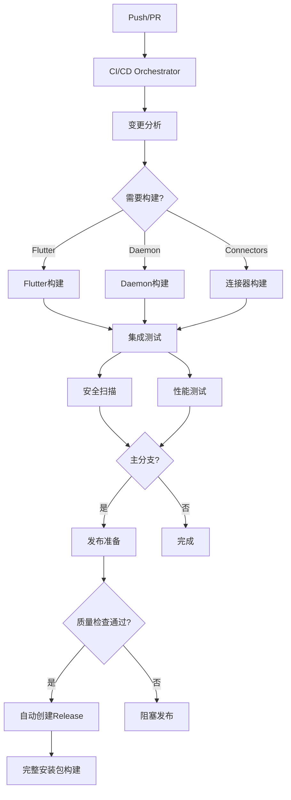

# 🚀 Linch Mind CI/CD System

## 概览

Linch Mind采用现代化的CI/CD体系，支持多平台构建、自动化测试、安全扫描和完整的安装包生成。

## 🏗️ 架构对齐的CI/CD体系

基于深入的项目架构分析，CI/CD体系完全对齐实际技术栈：

### 📊 实际技术架构
- **后端**: Python 3.13 + Poetry 1.8 + SQLAlchemy 2.0 + SQLite/SQLCipher
- **前端**: Flutter 3.32 + Dart 3.0 + Riverpod 2.4 + 跨平台支持
- **连接器**: C++ 17 + CMake 3.16 + 跨平台共享库
- **AI/ML**: FAISS 1.8 + NetworkX 3.4 + Sentence Transformers 3.3
- **架构**: 纯IPC通信 + 环境隔离 + ServiceFacade + 现代化错误处理



## 📋 工作流清单

### 核心构建工作流

| 工作流 | 文件 | 触发条件 | 功能描述 |
|--------|------|----------|----------|
| **🎼 CI/CD总编排** | `ci-orchestrator.yml` | Push/PR/定时 | 智能分析变更，条件触发其他工作流 |
| **🎯 Flutter构建** | `flutter-build.yml` | UI代码变更 | 多平台Flutter应用构建 (3.32+) |
| **🐍 Daemon构建** | `daemon-build.yml` | 后端代码变更 | Python 3.13 + Poetry + SQLite测试 |
| **🔗 连接器构建** | `connector-build.yml` | 连接器代码变更 | C++ + CMake跨平台构建 |
| **🔗 集成测试** | `integration-tests.yml` | 构建完成后 | IPC、环境隔离、性能基准测试 |
| **🏗️ 架构验证** | `architecture-validation.yml` | 定期/PR | 验证CI/CD与实际架构一致性 |

### 发布工作流

| 工作流 | 文件 | 触发条件 | 功能描述 |
|--------|------|----------|----------|
| **发布流程** | `release.yml` | 版本标签 | GitHub Releases、制品收集 |
| **完整安装包** | `package-installer.yml` | 版本标签 | 生成DEB/RPM/DMG/EXE安装包 |

### 支持文件

| 文件 | 用途 |
|------|------|
| `config/versions.yml` | 统一版本管理配置 |
| `GITHUB_ACTIONS_SETUP.md` | CI/CD配置指南 |

## 🎯 智能构建策略

### 变更检测
系统自动检测代码变更，只构建必要的组件：
- **UI变更** → 仅触发Flutter构建
- **后端变更** → 仅触发Daemon构建  
- **连接器变更** → 仅触发连接器构建
- **多组件变更** → 并行触发相关构建

### 条件执行
- **PR** → 仅构建和基础测试
- **主分支推送** → 完整构建 + 集成测试
- **版本标签** → 发布流程
- **定时任务** → 完整质量检查

## 📦 生产级安装包

### 支持的平台

#### Linux
- **DEB包** (`ubuntu/debian`) - 标准APT安装
- **RPM包** (`redhat/centos`) - 标准YUM/DNF安装  
- **AppImage** - 通用Linux包，免安装运行
- **Shell脚本** - 手动安装选项

#### macOS
- **DMG安装器** - 拖拽式安装
- **App Bundle** - 完整应用包

#### Windows
- **NSIS安装器** - 标准Windows安装程序
- **便携版** - 免安装版本

### 安装包内容
每个安装包都包含：
- ✅ **Python Daemon** - 完整后端服务
- ✅ **Flutter UI** - 跨平台用户界面
- ✅ **C++连接器** - 系统集成组件
- ✅ **Ollama** - 本地AI推理引擎
- ✅ **系统集成** - 服务脚本、桌面条目
- ✅ **自动启动** - 系统启动配置

## ⚙️ 配置管理

### 版本配置
所有版本信息统一在 `config/versions.yml` 中管理：

```yaml
versions:
  flutter: "3.24.3"
  python: "3.13" 
  ollama: "0.1.32"
  
build:
  platforms:
    flutter: ["linux", "macos", "windows", "android", "ios", "web"]
    installers: ["linux", "macos", "windows"]
    
packaging:
  include_ollama: true
  include_ai_models: false  # 按需下载
```

### 环境配置
支持三种环境：
- **development** - 本地开发
- **staging** - 测试环境
- **production** - 生产环境

## 🔒 质量保证

### 自动化测试
- **单元测试** - 组件级测试覆盖率>80%
- **集成测试** - IPC通信、连接器集成
- **端到端测试** - UI-Daemon完整流程
- **性能测试** - IPC延迟<10ms，启动时间<3s

### 安全扫描
- **依赖扫描** - Python/Flutter依赖安全检查
- **代码扫描** - Bandit静态分析
- **容器扫描** - Trivy漏洞扫描

### 代码质量
- **格式化** - Black/Prettier自动格式化
- **Lint检查** - Flake8/ESLint代码规范
- **类型检查** - MyPy类型安全

## 📊 性能监控

### 关键指标
- **IPC延迟** - 目标<10ms
- **启动时间** - 目标<3s
- **内存使用** - 峰值<500MB
- **测试覆盖率** - 目标>80%

### 自动基准测试
每次主分支推送自动运行性能基准测试，超出阈值时自动告警。

## 🚀 发布流程

### 自动发布
1. **质量检查** - 所有构建和测试通过
2. **版本计算** - 语义化版本自动递增
3. **标签创建** - 自动创建Git标签
4. **Release创建** - GitHub Releases (草稿)
5. **安装包构建** - 多平台完整安装包

### 手动发布
管理员可以：
- 编辑Release说明
- 发布正式版本
- 触发应用商店发布 (未来)

## 🛠️ 开发者使用

### 本地触发
```bash
# 触发完整构建
gh workflow run "CI/CD Orchestrator" -f workflow_type=all

# 仅构建测试
gh workflow run "CI/CD Orchestrator" -f workflow_type=build-only

# 强制重建所有组件
gh workflow run "CI/CD Orchestrator" -f force_rebuild=true
```

### 监控状态
- GitHub Actions页面查看实时状态
- Release页面下载最新安装包
- Artifacts页面下载构建制品

## 📈 持续改进

### 计划增强
- [ ] 应用商店自动发布
- [ ] 更多平台支持 (ARM64)
- [ ] 增量构建优化
- [ ] 更智能的测试策略
- [ ] 性能回归检测增强

### 贡献指南
1. 遵循现有工作流模式
2. 更新相关文档
3. 测试工作流变更
4. 获得代码审查批准

---

**注意**: 首次设置需要配置必要的Secrets和环境变量，详见 `GITHUB_ACTIONS_SETUP.md`。