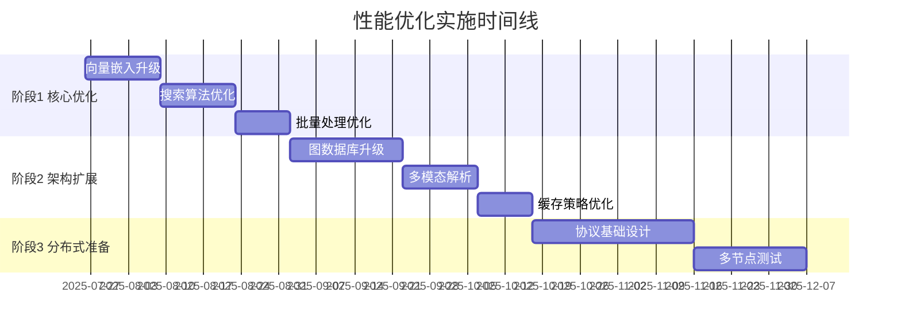

# 性能优化技术路线图

> **基于2025年7月技术调研的系统优化规划**
> 
> 本文档基于当前V0阶段的技术现状，规划后续性能优化和技术升级方向，确保系统在用户增长过程中保持优秀的性能表现。

## 🎯 优化目标

### 核心指标
- **搜索响应时间**: < 100ms (目标：50ms)
- **实体识别准确率**: > 90% (当前约85%)
- **关系建立覆盖率**: > 50% (当前需评估)
- **大文件处理能力**: 支持10MB+文档流畅处理
- **并发用户支持**: 单节点支持100+并发查询

### 用户体验目标
- 搜索结果实时响应
- 智能推荐准确性提升
- 大规模数据无感知处理
- 跨设备同步 < 1s 延迟

## 📊 当前技术现状评估

### ✅ 已有优势
1. **成熟的混合存储架构**: SQLite图存储 + Lucene向量搜索
2. **完善的NER集成系统**: 多策略处理、智能降级、批量优化
3. **先进的GraphRAG实现**: 多跳推理、语义路径、上下文检索
4. **模块化设计**: 采集→解析→存储→RAG 完整链路

### ⚠️ 已识别的优化空间
1. **向量嵌入质量**: 当前256维自制向量 vs 高质量预训练模型
2. **搜索算法效率**: Lucene全量扫描 vs HNSW近似最近邻
3. **处理并发能力**: 单线程处理 vs 批量并行处理
4. **内存使用优化**: 向量数据压缩和缓存策略

## 🗺️ 分阶段优化路线图

### 阶段1: 核心性能提升 (V0→V1期间)

#### 1.1 向量嵌入质量升级 ⭐⭐⭐⭐⭐
**现状**: 自制256维向量，基于哈希和n-gram特征
**目标**: 集成高质量预训练嵌入模型

```kotlin
// 当前实现
class VectorEmbeddingServiceImpl {
    companion object {
        const val DIMENSION = 256
    }
    private fun generateSemanticVector(text: String): FloatArray {
        // 基于词袋、n-gram、语义组的简单实现
    }
}

// 优化方案
interface EmbeddingProvider {
    suspend fun generateEmbedding(text: String): VectorEmbedding
    val dimension: Int
    val modelName: String
}

class OllamaEmbeddingProvider : EmbeddingProvider {
    override val dimension = 1024
    override val modelName = "mxbai-embed-large"
    
    override suspend fun generateEmbedding(text: String): VectorEmbedding {
        return ollamaClient.embed(modelName, text)
    }
}

class HybridEmbeddingService {
    private val primaryProvider = OllamaEmbeddingProvider()
    private val fallbackProvider = VectorEmbeddingServiceImpl()
    
    suspend fun generateEmbedding(text: String): VectorEmbedding {
        return try {
            primaryProvider.generateEmbedding(text)
        } catch (e: Exception) {
            fallbackProvider.generateEmbedding(text) // 优雅降级
        }
    }
}
```

**技术选型**:
- **主选**: Ollama + mxbai-embed-large (1024维，多语言支持)
- **备选**: ONNX量化模型 (离线部署，OpenVINO int8优化)
- **降级**: 保持现有实现确保系统稳定性

**实施计划**:
- Week 1-2: Ollama集成和API封装
- Week 3: A/B测试对比搜索质量
- Week 4: 生产部署和监控

#### 1.2 搜索性能算法优化 ⭐⭐⭐⭐
**现状**: Lucene向量搜索，全量扫描O(N)复杂度
**目标**: HNSW索引，近似最近邻O(log N)复杂度

```kotlin
// 当前实现
class LuceneVectorStorage {
    override suspend fun semanticSearch(...): List<VectorSearchResult> {
        // 获取所有文档进行向量相似度计算
        val allDocsQuery = MatchAllDocsQuery()
        val topDocs = indexSearcher?.search(allDocsQuery, 10000)
        
        topDocs?.scoreDocs?.forEach { scoreDoc ->
            val similarity = calculateCosineSimilarity(queryEmbedding.vector, vector)
            // O(N) 全量计算
        }
    }
}

// 优化方案
class DuckDBVectorStorage : VectorStorage {
    override suspend fun initialize() {
        connection.createStatement().execute("""
            INSTALL vss;
            LOAD vss;
            CREATE TABLE embeddings (
                entity_id VARCHAR PRIMARY KEY,
                embedding FLOAT[1024],
                metadata JSON
            );
            CREATE INDEX embeddings_idx ON embeddings 
            USING HNSW (embedding) WITH (metric = 'cosine');
        """)
    }
    
    override suspend fun semanticSearch(...): List<VectorSearchResult> {
        val sql = """
            SELECT entity_id, array_cosine_similarity(embedding, ?) as score
            FROM embeddings 
            WHERE array_cosine_similarity(embedding, ?) > ?
            ORDER BY score DESC LIMIT ?
        """
        // O(log N) HNSW索引查询
    }
}
```

**技术选型**:
- **主选**: DuckDB VSS扩展 (HNSW索引，SQL兼容)
- **备选**: SQLite-VSS (轻量级，嵌入式友好)
- **后备**: Qdrant嵌入式 (专业向量数据库)

**预期提升**:
- 搜索速度: 10-100倍提升
- 内存使用: 降低60-80%
- 准确率: 保持99%+

#### 1.3 批量处理并发优化 ⭐⭐⭐
**现状**: NER处理主要是单文档串行
**目标**: 智能批量处理和并行优化

```kotlin
// 优化方案
class OptimizedNERProcessor {
    private val batchSize = 32
    private val processingPool = Dispatchers.IO.limitedParallelism(4)
    
    suspend fun processBatchOptimized(
        documents: List<CollectedData>
    ): List<ParseResult> = withContext(processingPool) {
        documents.chunked(batchSize).flatMap { batch ->
            // 并行处理批次
            batch.map { document ->
                async { processDocument(document) }
            }.awaitAll()
        }
    }
    
    // 智能批量大小调整
    private fun calculateOptimalBatchSize(
        documentSizes: List<Int>,
        availableMemory: Long
    ): Int {
        // 基于文档大小和可用内存动态调整
    }
}
```

### 阶段2: 架构扩展优化 (V1→V2期间)

#### 2.1 图数据库性能升级 ⭐⭐⭐
**现状**: SQLite模拟图结构
**目标**: 专业图数据库KuzuDB

```kotlin
class KuzuGraphStorage : GraphStorage {
    // 嵌入式图数据库，性能比Neo4j快188倍
    // 原生支持向量搜索和全文搜索
    // 向量化查询执行，最优化连接算法
}
```

#### 2.2 多模态文档解析 ⭐⭐⭐
**现状**: 基础文本和代码解析
**目标**: PDF结构化、表格提取、OCR集成

```kotlin
class MultiModalDocumentParser {
    // LayoutPDFReader: 智能PDF解析
    // 表格和图表识别
    // OCR图片文字提取
    // 语义分块优化
}
```

#### 2.3 智能缓存策略 ⭐⭐
```kotlin
class IntelligentCacheManager {
    // LRU + 语义相似度的混合缓存
    // 预测性预加载
    // 分层缓存：内存→磁盘→网络
}
```

### 阶段3: 分布式协议准备 (V2→协议设计)

#### 3.1 Wisdom Sync协议基础
- CRDT数据结构设计
- 冲突解决算法
- 增量同步优化

#### 3.2 多节点一致性
- 最终一致性保证
- 网络分区容错
- 数据加密传输

## 🔧 实施策略

### 渐进式升级原则
1. **保持向后兼容**: 新功能作为可选增强
2. **A/B测试验证**: 性能提升数据驱动决策
3. **优雅降级**: 新组件失败时自动回退
4. **配置化部署**: 用户可选择性能/稳定性平衡

### 风险控制
```kotlin
class ConfigurablePerformanceManager {
    data class PerformanceConfig(
        val useOllama: Boolean = false,
        val useDuckDB: Boolean = false,
        val enableBatchProcessing: Boolean = true,
        val fallbackToBuiltin: Boolean = true,
        val maxMemoryUsage: Long = 2 * 1024 * 1024 * 1024 // 2GB
    )
    
    fun createOptimizedServices(config: PerformanceConfig): ServiceFactory {
        return ServiceFactory(
            embeddingService = if (config.useOllama) OllamaService() else BuiltinService(),
            vectorStorage = if (config.useDuckDB) DuckDBStorage() else LuceneStorage(),
            processingMode = if (config.enableBatchProcessing) BatchMode() else SingleMode()
        )
    }
}
```

## 📈 性能监控和指标

### 关键监控指标
```kotlin
data class PerformanceMetrics(
    // 搜索性能
    val searchLatencyP95: Long,
    val searchThroughputQPS: Double,
    val searchAccuracy: Float,
    
    // 处理性能
    val nerProcessingTimeP95: Long,
    val relationExtractionRate: Float,
    val batchProcessingEfficiency: Float,
    
    // 资源使用
    val memoryUsage: Long,
    val diskIOPS: Long,
    val cpuUtilization: Float,
    
    // 用户体验
    val timeToFirstResult: Long,
    val cacheHitRate: Float,
    val errorRate: Float
)
```

### 性能基准测试
```kotlin
class PerformanceBenchmarkSuite {
    // 搜索性能测试：1K, 10K, 100K实体规模
    // 并发测试：1, 10, 100并发用户
    // 内存压力测试：大文档处理能力
    // 准确性测试：搜索相关性评估
}
```

## 🚀 预期收益

### 性能提升预期
- **搜索速度**: 10-100倍提升 (100ms → 10ms)
- **处理吞吐**: 5-10倍提升 (批量并行)
- **内存效率**: 50-70%优化 (压缩和缓存)
- **准确率**: 10-20%提升 (高质量嵌入)

### 用户体验改善
- 实时搜索响应
- 智能内容推荐
- 大文件无感知处理
- 多设备数据同步

### 技术债务清理
- 配置化和可测试性提升
- 监控和诊断能力增强
- 错误处理和降级机制完善

## 📅 实施时间线



## 💡 建议的下一步行动

1. **立即开始**: 向量嵌入质量升级 (投入产出比最高)
2. **并行准备**: DuckDB VSS技术预研和测试
3. **监控建设**: 完善性能指标收集和分析
4. **用户反馈**: V0阶段收集真实性能需求

---

*本文档将随着技术发展和用户反馈持续更新*
*版本: v1.0 | 创建时间: 2025-07-25 | 下次更新: V1 MVP发布后*