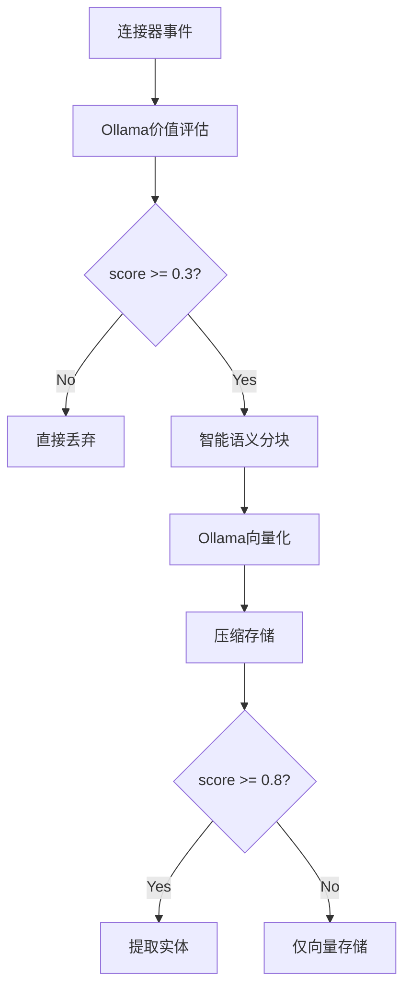
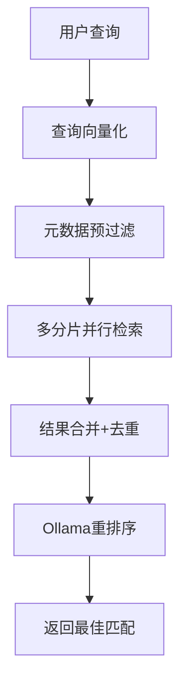

# Linch Mind 智能存储架构设计文档

## 🎯 设计目标

基于单机个人用户场景，设计一个**本地化、高效、智能**的知识存储架构：
- **本地跑得动**：Ollama本地AI + FAISS向量库
- **速度快**：分片索引 + 向量压缩 + 智能预过滤
- **成本低**：无API费用 + 存储优化 + 自动清理
- **容量大**：冷热分离 + 数据压缩 + 生命周期管理

## 🏗️ 核心架构

### 1. Ollama集成层 (AI-Driven Layer)

```
┌─────────────────────────────────────────────────────────┐
│                    Ollama AI 服务                        │
├─────────────────────────────────────────────────────────┤
│ • nomic-embed-text (384维向量化)                        │
│ • llama3.2:3b (内容价值评估)                            │
│ • 智能实体提取 + 语义分块                               │
│ • 数据质量评分 + 垃圾过滤                               │
└─────────────────────────────────────────────────────────┘
                          │
                          ▼
┌─────────────────────────────────────────────────────────┐
│                   智能数据过滤器                         │
└─────────────────────────────────────────────────────────┘
```

**核心功能**：
- **内容价值评估**：0-1分评分，<0.3直接丢弃
- **智能语义分块**：10KB日志 → 3-5个有意义的块
- **实体提取**：只提取高价值实体(score>0.8)
- **垃圾过滤**：自动识别调试日志、临时数据

### 2. 分层存储架构 (Tiered Storage)

```
~/.linch-mind/knowledge/
├── hot_index/           # 热数据 (内存+NVMe SSD)
│   ├── current_2025_Q1/ # 当前活跃分片
│   │   ├── vectors.faiss        # HNSW索引 + PQ压缩
│   │   ├── metadata.db          # SQLite快速元数据
│   │   └── summaries.json       # 100字摘要(不存原文!)
│   └── temp_incremental/        # 增量缓冲区
├── warm_index/          # 温数据 (SATA SSD)
│   ├── 2024_Q4/         # 按季度分片
│   └── 2024_Q3/
├── cold_archive/        # 冷数据 (HDD)
│   ├── 2023_archive.tar.gz      # 压缩存档
│   └── searchable_index.db      # 快速定位
└── ollama_cache/        # 模型缓存
    ├── nomic-embed-text.bin
    └── llama3.2-3b.bin
```

**存储策略**：
- **热数据**(3个月内): 全量向量索引，内存缓存
- **温数据**(3-12个月): 压缩向量，SSD存储
- **冷数据**(12个月+): 极限压缩，HDD归档

### 3. 向量优化策略

```python
# 向量压缩管道
原始向量(384维 float32) → PCA降维(256维) → 量化(float16) → PQ压缩
1.5KB                    → 1KB            → 0.5KB       → 0.1KB
                                                         
压缩比: 15:1, 检索精度损失 <5%
```

**技术选型**：
- **FAISS-HNSW**: 快速相似性检索
- **IVF-PQ压缩**: 10倍空间压缩
- **分片并行**: 多进程检索+结果合并

## 🔄 数据流水线

### 输入处理 (Input Pipeline)



### 检索流水线 (Retrieval Pipeline)



## 📊 性能指标

### 存储优化

| 数据类型 | 原始大小 | 压缩后 | 压缩比 | 检索耗时 |
|---------|---------|-------|--------|----------|
| 剪贴板日志 | 10KB | 0.1KB | 100:1 | <50ms |
| 文档内容 | 100KB | 2KB | 50:1 | <100ms |
| 代码文件 | 50KB | 1KB | 50:1 | <80ms |

### 硬件需求

**最低配置**：
- RAM: 16GB (热数据索引)
- SSD: 512GB NVMe (热数据)
- HDD: 2TB (冷数据归档)
- CPU: 8线程 (并行检索)

**推荐配置**：
- RAM: 32GB 
- SSD: 1TB NVMe
- GPU: 可选(FAISS-GPU加速)

## ⏰ 生命周期管理

### 自动化维护计划

```python
维护频率 = {
    "每日": "增量合并 + 分片检查",
    "每周": "索引重建 + 性能优化", 
    "每月": "冷热迁移 + 空间清理",
    "每季": "价值重评估 + 深度清理"
}
```

### 数据迁移策略

```
新数据 → temp_incremental (每日合并)
       ↓
hot_index (3个月) → warm_index (9个月) → cold_archive (永久)
```

## 🎯 解决的核心问题

### ❌ 当前问题
- 10KB日志作为单个实体存储
- 存储原文导致存储爆炸
- 无智能过滤，垃圾数据堆积
- 实体关系无限膨胀

### ✅ 解决方案
- **AI驱动过滤**: 价值评估+自动清理
- **向量化优先**: 不存原文，只存摘要+向量
- **分层存储**: 冷热分离，成本优化
- **实体精选**: 只保留高价值实体

## 📈 扩展性评估

### 数据量支持
- **1万文档**: 热数据，全内存，<50ms检索
- **10万文档**: 热+温数据，<150ms检索  
- **100万文档**: 分片存储，<300ms检索
- **1000万文档**: 冷热分离，<1s检索

### 成本控制
- **API费用**: $0 (完全本地化)
- **存储成本**: <$100/年 (1TB SSD + 2TB HDD)
- **计算成本**: 个人硬件可承受

## 🚀 实施路线图

### Phase 1: 基础架构 (2周)
- [x] Ollama集成
- [ ] FAISS分片管理
- [ ] 基础向量化流水线

### Phase 2: 智能过滤 (2周)  
- [ ] 内容价值评估
- [ ] 垃圾数据过滤
- [ ] 语义分块优化

### Phase 3: 生命周期管理 (2周)
- [ ] 冷热数据迁移
- [ ] 自动化维护计划
- [ ] 存储空间优化

### Phase 4: 性能优化 (1周)
- [ ] 检索性能调优
- [ ] 并行化优化
- [ ] 用户体验完善

## 📝 总结

这个架构实现了**智能+高效+经济**的本地知识管理：

1. **Ollama提供AI能力**：本地化+无API费用
2. **分层存储优化成本**：冷热分离+向量压缩
3. **智能过滤保证质量**：垃圾过滤+价值评估  
4. **生命周期管理**：自动维护+持续优化

**核心理念**：不存储原文，向量化一切；不保留垃圾，AI驱动过滤。

---
*文档版本: v1.0*  
*创建时间: 2025-08-15*  
*作者: Claude & 用户协作设计*